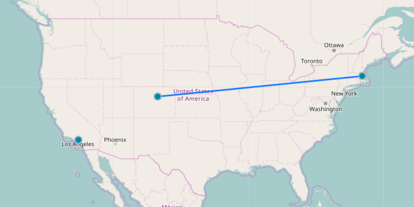
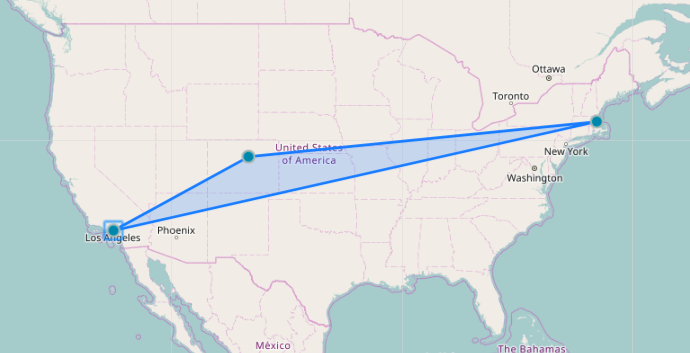
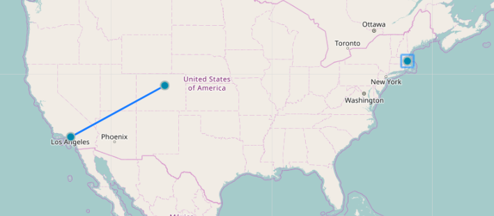

# Concept3D Interview : The Technical Challenge

### Overview

Hello prospective candidate! In this repo, you're given a boilerplate that contains all the libraries you'll need to complete the challenge. It's intended to examine your abilities in the following areas:

1. React/Redux knowledge
2. Algorithmic problem solving
3. General self-ownership of code to solve a problem, look up docs to learn a new tech (use a map library)
4. Clean, well organized and refactored code

### Requirements

1. As you'll see when you look into the boilerplate, there's two major components. The Form and the Map. The form will be used to add new markers to the map! The basic form has been set up, but lacks the functionality to save new markers. This part has two aspects - client side and server side. How you solve this is up to you, but the user story is:

  ```When I enter a valid latitude and longitude into the form with a name, and then press enter, I will see a new marker added to the map with the correct name in the popup```

  Notes:

  - Markers must persist on refresh of the browser. It is not required to persist on the server side, but it'll be more impressive if it does.
  - **Valid** latitude and longitude is important. How you want to verify that is up to you.
  - Use Redux and Reducers to update the state of your app.
  - Bonus: When adding a new marker, the center of the map will be set to the [lat, lng] of the new marker.

2. Now that you're adding your new markers and saving them, let's make some shapes! Using the Leaflet library, let's make a polygon out of our markers. Here's the user story:

  ```When I click on a marker, it's location will be used as a point for a polygon. Successive clicks will add markers to the polygon, and clicking a point will remove it from the polygon```

  Here's an example in pictures:

  After 2 Clicks:

  

  After 3 Clicks:

  

  After clicking on "Boston"

  

  Notes:

  - Use the React-Leaflet library to add your polygon
  - Use Redux to update state


3. BONUS TIME!

  Add some other fun features with the React-Leaflet library. Be creative!
  Use the Create-React-App Testing Library which is Jest to write some unit tests.

### Intructions

1. Clone this repo to your own machine.
2. `cd c3d-challenge`
3. Delete the .git folder.
4. Initialize a new git repo on your own Github profile.
5. `npm install`
6. Open a separate terminal tab and run `npm run dev` (this will start your server)
7. `npm start`
8. Good luck!

This project was made with Create-React-App, so it supports hot-reloading anytime you make a change!


### Helpful Links:

- [Leaflet](http://leafletjs.com/)
- [React Leaflet](https://github.com/PaulLeCam/react-leaflet)
- [Redux](http://redux.js.org/)


### Final notes:

Take as long as you need to feel to do your best work. However, this challenge should realistically take no longer than approximately 5-6 hours.

Have fun!
